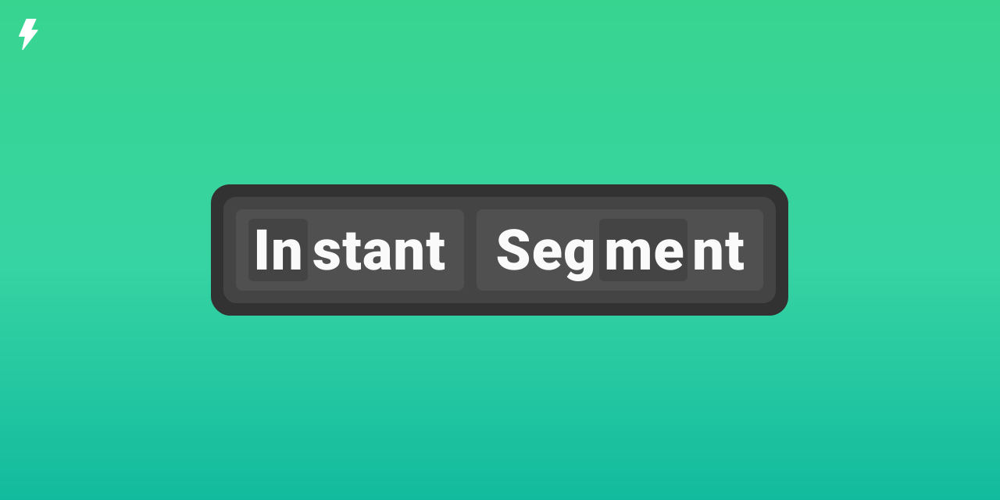

# instant-segment: fast English word segmentation in Rust

instant-segment is a fast Apache-2.0 library for English word segmentation.
It is based on the Python [wordsegment][python] project written by Grant Jenkins,
which is in turn based on code from Peter Norvig's chapter [Natural Language
Corpus Data][chapter] from the book [Beautiful Data][book] (Segaran and Hammerbacher, 2009).

The data files in this repository are derived from the [Google Web Trillion Word
Corpus][corpus], as described by Thorsten Brants and Alex Franz, and [distributed][distributed] by the
Linguistic Data Consortium. Note that this data **"may only be used for linguistic
education and research"**, so for any other usage you should acquire a different data set.

For the microbenchmark included in this repository, instant-segment is ~17x faster than
the Python implementation. Further optimizations are planned -- see the [issues][issues].
The API has been carefully constructed so that multiple segmentations can share
the underlying state (mainly the unigram and bigram maps) to allow parallel usage.

[python]: https://github.com/grantjenks/python-wordsegment
[chapter]: http://norvig.com/ngrams/
[book]: http://oreilly.com/catalog/9780596157111/
[corpus]: http://googleresearch.blogspot.com/2006/08/all-our-n-gram-are-belong-to-you.html
[distributed]: https://catalog.ldc.upenn.edu/LDC2006T13
[issues]: https://github.com/InstantDomainSearch/instant-segment/issues
